# Investigating Stack Depth in xLSTM Architectures for Vibration Time Series Prediction

Official implementation of **Investigating Stack Depth in xLSTM Architectures for Vibration Time Series Prediction**, trained on MTSU's HPC cluster using DeepSpeed ZeRO Stage 2.

---

This study evaluates five xLSTM configurations ranging from 1 to 5 stacked mLSTM-sLSTM block pairs for one-step-ahead vibration displacement forecasting. Results reveal a strongly non-monotonic relationship between stack depth and predictive accuracy, with the 1-stack configuration achieving the best performance (R² = 0.9869) and the 4-stack configuration undergoing near-complete training collapse.

## 💥 News 💥
- **[05.01.2026]** Repository released with full training code, DeepSpeed config, and SLURM job script.


- **[07.06.2026]** Added xlstm with different attention mechanisms including: ProbSparce, hierarchical chunk wise processing, wavelet decomposition with channel wise frequency attention, and gated attention memory.

- **[08.21.2026]** Added ExperimentalIdea folder. Currently holds xlstm_loss.py. Currently holds the following loss calculations: mse, huber, huber_gradient, adaptive, peak_aware.
---

## Overview

Vibration time series prediction from industrial interferometer signals presents a challenging forecasting problem due to high-frequency content, large dynamic range, and intermittent spike artifacts. This repository investigates how stacking depth in xLSTM architectures affects forecasting performance on this domain.

Five architectures are evaluated — a single mLSTM-sLSTM block pair (1-stack) up to five sequential block pairs (5-stack) — with all other architectural and training parameters held constant. All experiments were conducted on two NVIDIA RTX A5000 GPUs using DeepSpeed ZeRO Stage 2 optimization and FP16 mixed precision.

---

## Architecture

<p align="center">
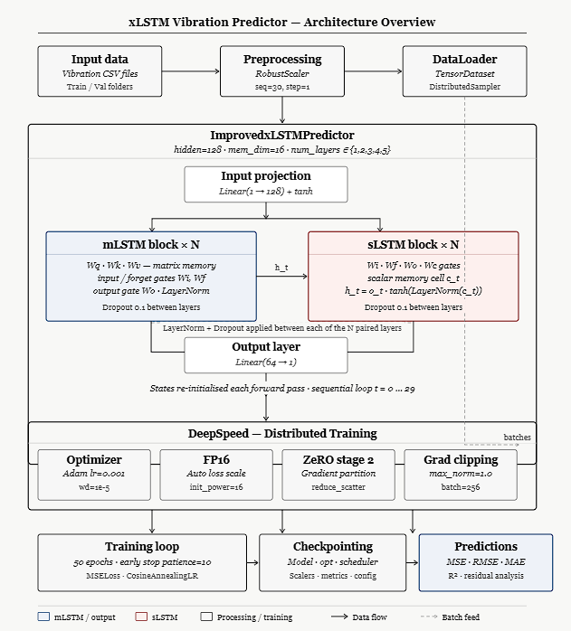
</p>

The xLSTM model is built from two complementary recurrent block types stacked to varying depths:

**mLSTM Block** — operates on a 16×16 matrix-valued memory tensor updated at each timestep via outer-product operations. Gate outputs are constrained to [0.05, 0.95] to prevent saturation, and the memory update is scaled by 0.1 to prevent exponential growth.

**sLSTM Block** — follows a conventional gated recurrent structure with scalar memory cells, applying LayerNorm to the cell state before the tanh activation for stable activation distributions across long sequences.

The stacking scheme for each configuration is: N mLSTM blocks followed by N sLSTM blocks, where N ∈ {1, 2, 3, 4, 5}. LayerNorm and Dropout (p = 0.1) are inserted between consecutive same-type blocks to stabilize gradient flow. Input sequences of 30 timesteps are projected from 1 dimension to a 128-dimensional hidden representation before being passed through the stacked blocks. The hidden state at the final timestep is projected to a single displacement prediction.

---

## Data

Vibration displacement signals (nm) were collected via interferometer from a lathe machine over time (ms). Raw signals exhibit two primary artifacts that require correction before training: a consistent downward drift and intermittent sharp spikes from sensor noise.

<p align="center">
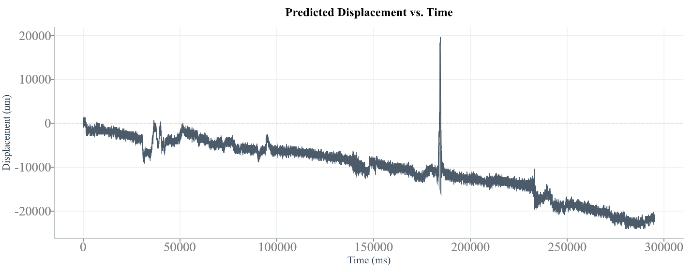
</p>

*Figure 1. Representative raw displacement signal showing downward slope drift and a sharp spike artifact at approximately 185,000 ms.*

Preprocessing steps applied before training:

1. **Linear regression detrending** to remove measurement drift.
2. **Spike correction** using a 3-standard-deviation threshold in 10,000 ms windows, with linear interpolation over detected outliers.
3. **Sequence construction** with length 30 and stride 1 for one-step-ahead forecasting.
4. **RobustScaler normalization** fit on the training set and applied to validation.

The dataset comprises 22 CSV files for training (~7.6M sequences) and 1 CSV file for validation (~605K sequences).

---

## Results

### Quantitative Comparison Across Stack Depths

| Configuration | R²     | RMSE (nm) | MAE (nm) | Epochs | Train Time (h) |
|---------------|--------|-----------|----------|--------|----------------|
| **1-Stack**   | **0.9869** | **74.41** | **38.88** | 35 | 3.16 |
| 2-Stack       | 0.9828 | 85.33     | 44.93    | 29     | 15.29          |
| 3-Stack       | 0.9650 | 121.60    | 60.26    | 13     | 3.38           |
| 4-Stack       | 0.5286 | 446.25    | 65.00    | 43     | 45.65          |
| 5-Stack       | 0.8796 | 225.54    | 72.81    | 13     | 17.54          |

*Evaluated on 605,772 validation sequences. Training time and epoch count reflect the full training run including early stopping.*

The 4-stack configuration represents a qualitatively different failure mode: despite the longest training run (45.65 hours, 43 epochs), the model became trapped in a poor local minimum and generated large-magnitude hallucinated predictions on a subset of high-amplitude inputs. The 5-stack partially recovered (R² = 0.8796), suggesting a different convergence trajectory.

---

### Temporal Tracking — Predicted vs. Actual Displacement

**1-Stack** — Near-perfect overlap between predicted and actual displacement across the full dataset. In the detail view, the model correctly captures rapid direction reversals, peak sharpness, and zero-crossings with only marginal underestimation at the highest-amplitude spikes.

<p align="center">
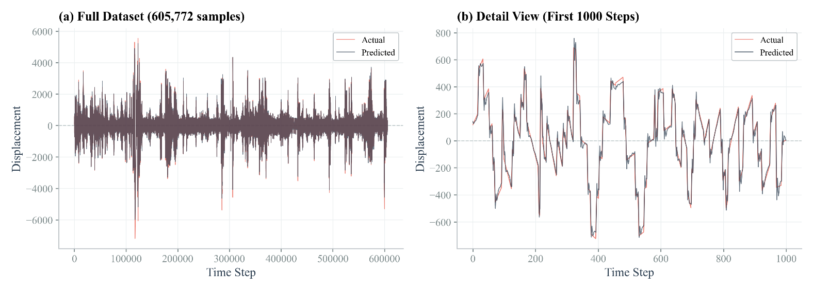
</p>

**2-Stack** — Produces visually similar tracking but with slightly more divergence at high-amplitude burst events, consistent with its higher RMSE.

<p align="center">
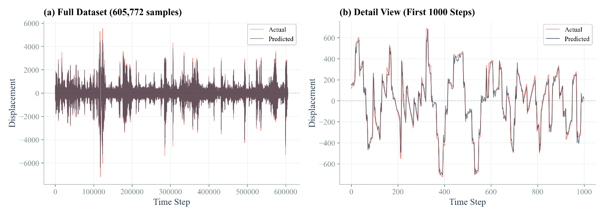
</p>

**3-Stack** — Shows increasing divergence at peak amplitude events. The detail view confirms growing phase misalignment in the 400–600 step window, consistent with the degraded R² = 0.9650.

<p align="center">
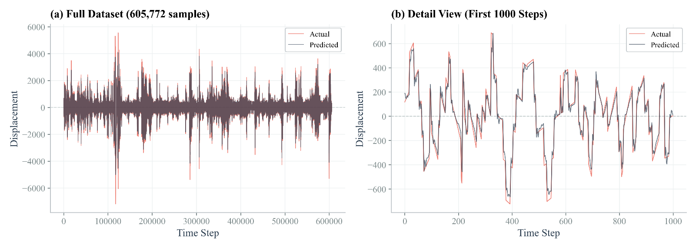
</p>

**4-Stack** — Exhibits the most visually striking failure: a hallucinated spike near time step 120,000 reaching approximately 10,000 nm with no corresponding feature in the actual signal. The predicted axis range extends to ±10,000 nm, confirming that the model generates large-magnitude out-of-distribution predictions on a subset of inputs.

<p align="center">
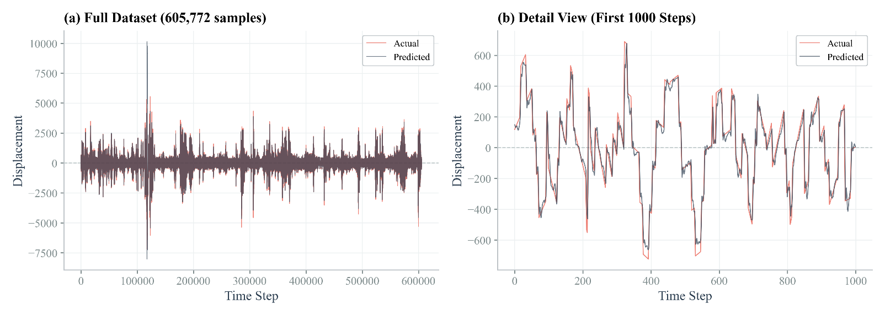
</p>

**5-Stack** — Shows a different failure signature: a spurious deep negative spike near time step 120,000 and asymmetric amplitude envelope clipping. The detail view confirms the predicted line has become noticeably smoother and less reactive than the actual signal.

<p align="center">
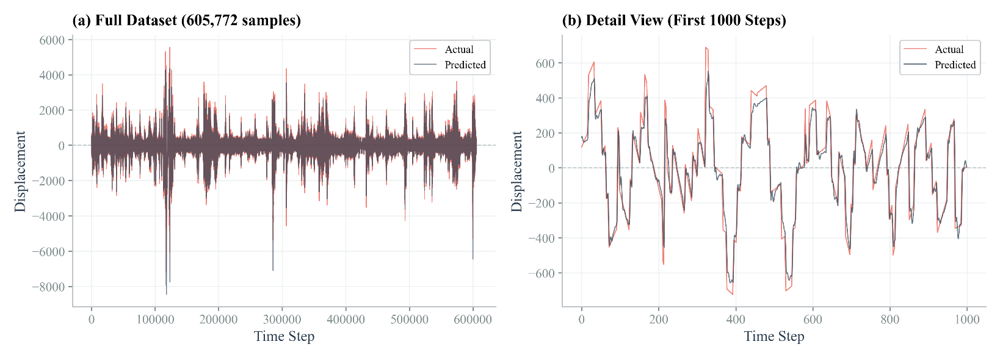
</p>

---

### Residual Analysis

All configurations that converged successfully exhibit an S-shaped nonlinear bias: residuals are increasingly negative at large negative predicted displacements and increasingly positive at large positive ones. This regression-toward-the-mean behavior is a structural property of MSE-trained xLSTM on this dataset and grows in magnitude with stack depth.

**1-Stack** — Tightest residual distribution, near-zero mean of −2.24 nm.

<p align="center">
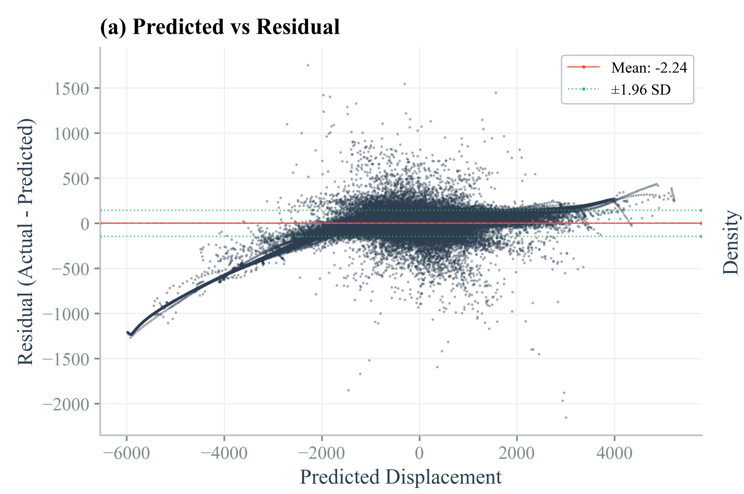
</p>

**2-Stack** — Almost identical S-shaped pattern with a negligible mean bias of −1.24 nm.

<p align="center">
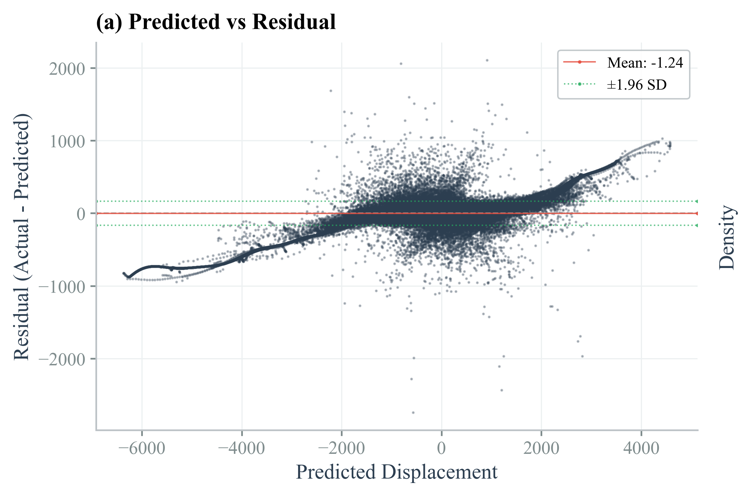
</p>

**3-Stack** — S-curve deepens noticeably; residuals reach approximately −2,000 nm at the most negative predicted values. Mean bias increases to −10.92 nm.

<p align="center">
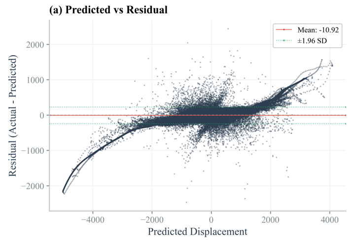
</p>

**4-Stack** — Qualitatively different failure mode. For predicted displacements beyond approximately 4,000 nm, residuals plunge in a tight diagonal arc to below −15,000 nm. Mean bias −11.63 nm.

<p align="center">
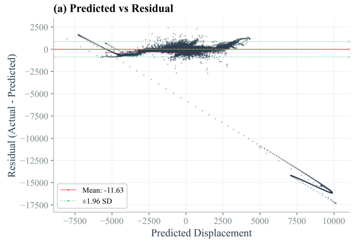
</p>

**5-Stack** — Partially recovers with a small positive mean bias of +4.90 nm, but shows a structured downward arc for predicted values in the 0 to −2,000 nm range, with residuals dropping to approximately −7,000 nm.

<p align="center">
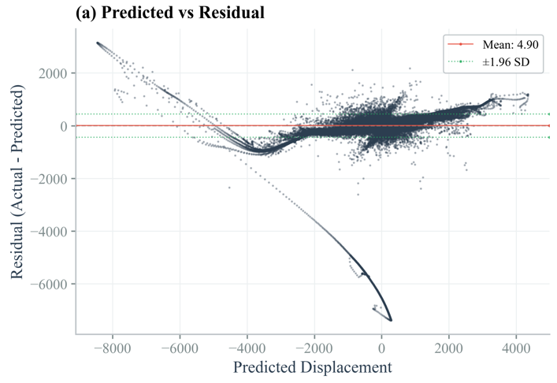
</p>

---

## Repository Structure

```
.
├── xlstm_v4_deepspeed.py          # Main training script
├── run_xlstm_v4_deepspeed.slurm   # SLURM job submission script
├── ds_config.json                 # DeepSpeed ZeRO Stage 2 configuration
├── figures/                       # Result plots and architecture diagram
└── README.md
```

---

## Installation

**Prerequisites:** Python 3.8+, PyTorch with CUDA, and a SLURM-managed cluster with NVIDIA GPUs.

Install dependencies:

```bash
pip install deepspeed torch numpy pandas scikit-learn matplotlib tqdm
```

---

## Data Preparation

Place CSV files (two columns: time, displacement) into the following structure:

```
Data/
├── Train/    # 22 CSV files (~7.6M training sequences)
└── Test/     # 1 CSV file  (~605K validation sequences)
```

Update `DATA_FOLDER` in `xlstm_v4_deepspeed.py` to match your path.

---

## Training

### Configuring Stack Depth

Open `xlstm_v4_deepspeed.py` and set `NUM_LAYERS` to the desired stack depth (1–5):

```python
NUM_LAYERS = 1   # ← Change this to 1, 2, 3, 4, or 5
```

### Running on a SLURM Cluster

Submit the job using the provided SLURM script:

```bash
sbatch run_xlstm_v4_deepspeed.slurm
```

The script launches DeepSpeed across 2 GPUs on the `research-gpu` partition:

```bash
deepspeed --num_gpus=2 xlstm_v4_deepspeed.py \
    --deepspeed \
    --deepspeed_config ds_config.json
```

### DeepSpeed Configuration

The `ds_config.json` enables ZeRO Stage 2 with FP16 mixed precision:

```json
{
  "train_batch_size": 256,
  "train_micro_batch_size_per_gpu": 128,
  "fp16": { "enabled": true, "initial_scale_power": 16 },
  "zero_optimization": { "stage": 2, "overlap_comm": true }
}
```

---

## Training Details

| Setting | Value |
|---|---|
| Optimizer | Adam, lr = 1×10⁻³, weight decay = 1×10⁻⁵ |
| LR Scheduler | ReduceLROnPlateau (patience=3, factor=0.5) |
| Gradient Clipping | max norm 1.0 |
| Early Stopping | patience = 10 epochs |
| Batch Size | 256 (128 per GPU) |
| Sequence Length | 30 timesteps |
| Hidden Size | 128 |
| Memory Dimension | 16×16 (mLSTM) |
| Dropout | 0.1 |
| Hardware | 2× NVIDIA RTX A5000 (24 GB each) |
| Precision | FP16 via DeepSpeed auto loss scaling |

---

## Key Findings

- The **1-stack configuration** achieves the best performance across all metrics (R² = 0.9869, RMSE = 74.41 nm, MAE = 38.88 nm) and is the recommended default for this task.
- Performance degrades progressively through 3-stack, collapses catastrophically at 4-stack (R² = 0.5286, 45.65 h training), then partially recovers at 5-stack.
- The **nonlinear S-shaped residual bias** (regression toward the mean at extreme amplitudes) is a consistent structural property of MSE-trained xLSTM on high-dynamic-range vibration signals, and grows in magnitude with depth.
- DeepSpeed ZeRO Stage 2 enabled stable training across all configurations but did not resolve fundamental optimization difficulties in deep recurrent stacks.

---

## Citation

If you find this work useful, please consider citing:

```bibtex
@article{xlstm_stack_depth_vibration,
  title   = {Investigating Stack Depth in xLSTM Architectures for Vibration Time Series Prediction},
  year    = {2026}
}
```

### References

[1] X. Fan, C. Tao, and J. Zhao, "Advanced stock price prediction with xLSTM-based models: Improving long-term forecasting," in *2024 11th International Conference on Soft Computing & Machine Intelligence (ISCMI)*. IEEE, 2024, pp. 117–123.

[2] M. Alharthi and A. Mahmood, "xLSTMTime: Long-Term Time Series Forecasting with xLSTM," *AI*, vol. 5, no. 3, pp. 1482–1495, Aug. 2024. doi: [10.3390/ai5030071](https://doi.org/10.3390/ai5030071)
